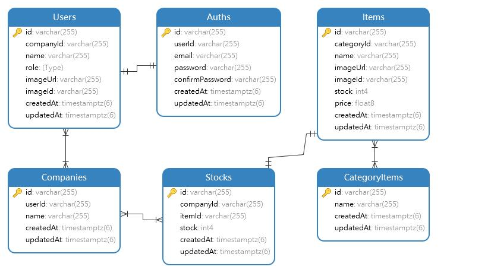

# THR Lebaran Mini Challenge 4 Team-03

## Database Structure

     

# API Documentation

<a href="https://documenter.getpostman.com/view/22814931/2sA35EY2XU" target="_blank" title="Postman Documentation"/>

[READ HERE](#)

# EndPoint

### API

| METHOD | End Point   | Deskripsi | params |
| ------ | ----------- | --------- | ------ |
| GET    | /api/v1/    | -         | [-]    |
| GET    | /api/v1/:id | -         |        |
| POST   | /api/v1/    | -         |        |
| PUT    | /api/v1/:id | -         |        |
| DEL    | /api/v1/:id | -         |        |
|        |             |           |        |

### Web Page

| End Point | Deskripsi | link                  |
| --------- | --------- | --------------------- |
| /         | -         | http://localhost:2000 |

# Data Team 3

|                      |                           |
| -------------------- | ------------------------- |
| **Anggota Tim 03**   | _Reinanda Faris_          |
|                      | _Rizaldi Mustakim_        |
|                      | _Viery Nugroho_           |
|                      | _Asyifa Maharani Gustina_ |
|                      | _Qonita Afifah_           |
|                      |                           |
| **Kelas**            | _FSW 1_                   |
|                      |                           |
| **ID Fasil**         | _F-FSW24001086_           |
| **Nama Fasilitator** | _Imam Taufiq Hermawan_    |
|                      |                           |

# Fullstack Web Development

### KM x Binar Academy Batch 6

|                                   |
| --------------------------------- |
| **Catatan**                       |
| Mini Challenge - Stock Management |
